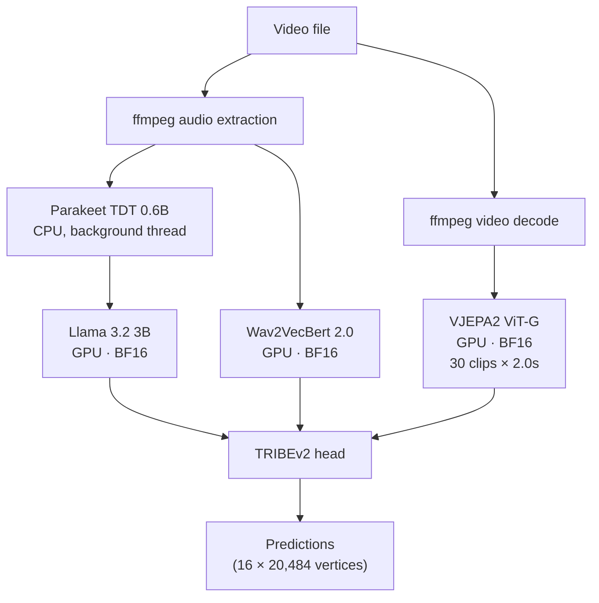

# Rarámuri

Fast TRIBEv2 inference on NVIDIA Blackwell.

Rarámuri wraps [TRIBEv2](https://github.com/facebookresearch/tribev2) in a faster, easier-to-run inference stack for NVIDIA DGX Spark and other Blackwell targets. On GB10, the default path is about **3.3× faster** than the FP32 baseline through precision tuning, front-loaded transcription, and model caching, without changing the final predictions in any meaningful way.

## What Rarámuri does

Rarámuri predicts voxel-level cortical activation from video. The pipeline runs five models:

1. **Parakeet TDT 0.6B** (NVIDIA NeMo) — speech-to-text transcription
2. **VJEPA2 ViT-G** — video feature extraction, 64 frames per clip at 256×256
3. **Wav2Vec 2.0** — audio feature extraction
4. **Llama 3.2 3B** — contextualised word embeddings
5. **TRIBEv2 head** — maps multimodal features to 20,484-voxel brain predictions


It is heavily based on TRIBEv2, but extensively optimised for Grace Blackwell architectures:

- **Mixed precision <3 Blackwell**: VJEPA2, Wav2Vec, and Llama run in BF16 unless you override them, which cuts memory traffic and materially improves throughput on GB10 without meaningfully changing the final voxel predictions.
- **Optional FP8 quantisation on selected extractors**: VJEPA2, Wav2VecBert, and Llama can each be switched to FP8 independently for lower latency when a small amount of quality drift is acceptable.
- **Front-loaded CPU transcription**: Parakeet transcription starts early on CPU in a background thread, overlapping with GPU model loading and event construction instead of sitting on the critical path.
- **Configurable parallel extractor scheduling**: text, audio, and optionally video feature extractors can prepare concurrently, while Hugging Face model loads remain serialized behind a lock to avoid safetensor/meta-tensor race conditions.
- **Hot-path model persistence**: extractor models can stay resident across requests instead of being freed after each stage, which removes repeated reload overhead for server and batch workflows.
- **Aggressive warmup and cache seeding**: the image preloads spaCy, NLTK, and MNE assets at build time, the server warms TRIBEv2 and runtime dependencies at startup, and extracted features are cached on disk via `exca` so repeat runs can skip expensive work entirely.

A todo: one day most of this ought to run in NVFP4. Unfortunately, MSLK has other ideas at the moment.

## Results

Measured on NVIDIA GB10 (DGX Spark), 130.7 GB unified memory, `aarch64`.

### End-to-end timing (35-second clip, 69 words, 4 sentences)

| Configuration | Wall time | Speedup | Quality |
|---|---:|---:|---|
| Baseline (FP32, sequential, WhisperX) | 438.2s | 1.0× | Reference |
| **Rarámuri default** (BF16, parallel, Parakeet) | **131.1s** | **3.3×** | Lossless (0.11% NRMSE) |
| Rarámuri fast (BF16 + FP8 VJEPA2) | ~95s | 4.6× | 0.43% NRMSE |
| Cache-warm (same video, second run) | ~20s | 22× | Identical |
| Hot server (models pre-loaded) | <2s | >200× | Identical |

### Per-component breakdown (35-second clip)

| Component | Baseline | Rarámuri | Speedup | How? |
|---|---:|---:|---:|---|
| VJEPA2 (70 clips) | 328.0s (4.36s/clip) | 67.2s (0.71s/clip) | **6.1×/clip** | BF16 inference |
| Wav2VecBert | ~15s | 48.3s* | — | BF16 autocast (parallel with text) |
| Llama 3.2 3B | ~36s | 49.8s* | — | BF16 + batch size 32 (parallel with audio) |
| Transcription (WhisperX → Parakeet) | ~47s | 18.7s (hidden) | ∞ | CPU background thread, overlapped |
| Event build | ~47s | 0.9s | 52× | Parakeet front-loaded, spaCy cached |
| Model load | ~2s | 4.2s | — | Includes Parakeet preload |
| TRIBEv2 head | ~2s | ~2s | — | — |

\* Audio and text extractors run in parallel (mode 1). Wall time for the parallel group is ~50s rather than ~85s sequential.

### Previous benchmark (15-second clip, 17 words, 4 sentences)

| Configuration | Wall time | Speedup | Quality |
|---|---:|---:|---|
| Baseline (FP32, sequential) | 260.6s | 1.0× | Reference |
| **Rarámuri default** (BF16, parallel) | **107.8s** | **2.4×** | Lossless (0.02% NRMSE) |

### Precision quality

BF16 predictions were compared against FP32 on the same 35-second input (35 timesteps × 20,484 vertices = 717,940 voxel predictions):

| Metric | BF16 vs FP32 |
|---|---:|
| NRMSE | 0.108% |
| Global Pearson r | 0.999955 |
| Mean absolute error | 0.00117 |
| Max absolute error | 0.01132 |
| Per-timestep r (min) | 0.99990 |
| Per-timestep r (mean) | 0.99996 |
| Values differing by >0.01 | 0.00% |

No single voxel prediction differs by more than 0.012 between FP32 and BF16. The activation distributions are virtually identical (mean, std, and range match to 3+ decimal places).


BF16 is the default. FP8 is available as an opt-in when you want lower latency and can tolerate small quality drift.

## Supported hardware

| Target | GPU | Memory | Status |
|---|---|---|---|
| DGX Spark / GB10 | 1× GB10 | 130.7 GB unified | Tested, primary target |
| B200 | 1× B200 | 192 GB HBM3e | Planned |
| Multi-GPU | 2× GB10 or 2× B200 | — | Planned |

## Quick start

```bash
# Pull the published image
docker pull ghcr.io/chrisvoncsefalvay/raramuri:latest

# Or build it locally
docker build -t ghcr.io/chrisvoncsefalvay/raramuri:latest -f docker/Dockerfile .

# Run inference on a local file (cold start, ~108s for 15s clip)
docker run --gpus all \
  -v /path/to/models:/models \
  -e HF_TOKEN=$HF_TOKEN \
  -e RARAMURI_TRANSCRIPT_BACKEND=parakeet \
  ghcr.io/chrisvoncsefalvay/raramuri:latest \
  /path/to/video.mp4 -o /models/results.json

# Run inference on a YouTube URL (first 30 seconds)
docker run --gpus all \
  -v /path/to/models:/models \
  -e HF_TOKEN=$HF_TOKEN \
  -e RARAMURI_TRANSCRIPT_BACKEND=parakeet \
  ghcr.io/chrisvoncsefalvay/raramuri:latest \
  "https://www.youtube.com/watch?v=..." --start-time 00:00:00 --end-time 00:00:30 \
  -o /models/results.json

# Run the hot server (default port 8765)
docker run --gpus all \
  -v /path/to/models:/models \
  -e HF_TOKEN=$HF_TOKEN \
  -e RARAMURI_TRANSCRIPT_BACKEND=parakeet \
  -e RARAMURI_PERSIST_EXTRACTOR_MODELS=1 \
  -e RARAMURI_VJEPA_DTYPE=bf16 \
  -p 8765:8765 \
  --entrypoint python \
  ghcr.io/chrisvoncsefalvay/raramuri:latest \
  /app/infer_server.py --port 8765
```

Published image: `ghcr.io/chrisvoncsefalvay/raramuri:latest`.

The CLI accepts a local file path or any [yt-dlp-supported URL](https://github.com/yt-dlp/yt-dlp/blob/master/supportedsites.md) as the first positional argument. The server accepts the same sources via the `video_path` (local) or `video_url` (remote) fields.

### Video ingestion

Remote URLs are downloaded via `yt-dlp` at up to 720p (MP4). When `start_time` and/or `end_time` are provided, yt-dlp's `--download-sections` is used to download only the requested range — the full video is never fetched. Local files are used directly unless a time range is requested, in which case `ffmpeg` trims a copy.

The pipeline accepts any source yt-dlp can handle: YouTube, Vimeo, Twitter/X, direct MP4 URLs, and [1,700+ other sites](https://github.com/yt-dlp/yt-dlp/blob/master/supportedsites.md). Time ranges use `HH:MM:SS` format or bare seconds.

Downloads go to a temporary directory that is cleaned up after inference completes (or fails). Transfer timing metadata is included in the result JSON under `timing.transfer.input_prepare`.

The image expects a runtime Hugging Face token because `meta-llama/Llama-3.2-3B` is gated. Startup warmup will fail fast if the token is missing or does not have access.

### Server API

The server stays unready (`GET /ready` returns 503) until all models are warmed.

| Endpoint | Method | Description |
|---|---|---|
| `/health` | GET | Liveness check (always 200 when process is up) |
| `/ready` | GET | Readiness check (200 when models are warmed, 503 otherwise) |
| `/status` | GET | Current step, elapsed time, memory usage, and job counts |
| `/metrics` | GET | Prometheus-format metrics |
| `/infer` | POST | Synchronous inference — blocks until complete, returns result JSON |
| `/jobs` | POST | Async inference — returns immediately with a job ID |
| `/jobs/{id}` | GET | Poll job status, progress, and current step |
| `/jobs/{id}/result` | GET | Retrieve completed job result (409 if not done) |
| `/jobs/{id}/cancel` | POST | Cancel a queued job (409 if already running or finished) |
| `/jobs/{id}/visualize` | POST | Render a composite visualization video from completed results |
| `/files/{filename}` | GET | Download a rendered visualization video |

Both `/infer` and `/jobs` accept the same JSON body:

```json
{
  "video_path": "/path/to/local/video.mp4",
  "video_url": "https://www.youtube.com/watch?v=...",
  "start_time": "00:00:00",
  "end_time": "00:00:30",
  "output": "/models/results.json"
}
```

Provide exactly one of `video_path` or `video_url`. `start_time`, `end_time`, and `output` are optional.

Example — synchronous request:

```bash
curl http://127.0.0.1:8765/ready
curl http://127.0.0.1:8765/status | jq
curl -X POST http://127.0.0.1:8765/infer \
  -H 'Content-Type: application/json' \
  -d '{"video_path":"/path/to/video.mp4","output":"/models/results.json"}'
```

Example — async job with progress polling:

```bash
# Submit
JOB=$(curl -s -X POST http://127.0.0.1:8765/jobs \
  -H 'Content-Type: application/json' \
  -d '{"video_url":"https://www.youtube.com/watch?v=...","end_time":"00:00:25"}')
JOB_ID=$(echo "$JOB" | jq -r .job_id)

# Poll progress
curl -s "http://127.0.0.1:8765/jobs/$JOB_ID" | jq '{status, phase, step, progress_ratio}'

# Retrieve result when complete
curl -s "http://127.0.0.1:8765/jobs/$JOB_ID/result" | jq .result.shape
```

Example — composite visualization:

```bash
# After a job completes, render a side-by-side video
curl -s -X POST "http://127.0.0.1:8765/jobs/$JOB_ID/visualize" \
  -H 'Content-Type: application/json' \
  -d '{"fps": 24, "width": 1920, "height": 540}' | jq .

# Download the rendered video
FILENAME=$(curl -s -X POST "http://127.0.0.1:8765/jobs/$JOB_ID/visualize" \
  -H 'Content-Type: application/json' -d '{}' | jq -r .download_url)
curl -o composite.mp4 "http://127.0.0.1:8765$FILENAME"
```

The visualization renders a composite MP4 with the original video (timestamped) on the left, a [nilearn glass brain](https://nilearn.github.io/dev/auto_examples/01_plotting/plot_demo_glass_brain_extensive.html) of predicted cortical activations on the right, captions at the bottom left, and a progressively drawn audio spectrum at the bottom right. The 1 Hz brain predictions are linearly interpolated to the output frame rate for smooth playback. Audio is muxed from the original source.

## Configuration

Most tuning is exposed through environment variables. The defaults are the recommended GB10 configuration.

### Precision knobs

| Variable | Default | Options | Effect |
|---|---|---|---|
| `RARAMURI_VJEPA_DTYPE` | `bf16` | `fp32`, `fp16`, `bf16` | VJEPA2 model precision |
| `RARAMURI_AUDIO_DTYPE` | `bf16` | `fp32`, `fp16`, `bf16` | Wav2VecBert precision |
| `RARAMURI_TEXT_DTYPE` | `bf16` | `fp32`, `fp16`, `bf16` | Llama 3.2 precision |
| `RARAMURI_VJEPA_QUANT` | `none` | `none`, `fp8` | FP8 quantisation for VJEPA2 |
| `RARAMURI_AUDIO_QUANT` | `none` | `none`, `fp8` | FP8 quantisation for Wav2VecBert |
| `RARAMURI_TEXT_QUANT` | `none` | `none`, `fp8` | FP8 quantisation for Llama |

### Pipeline knobs

| Variable | Default | Options | Effect |
|---|---|---|---|
| `RARAMURI_TRANSCRIPT_BACKEND` | — | `parakeet`, `disabled` | Speech-to-text backend |
| `RARAMURI_PARALLEL_EXTRACTORS` | `0` | `0`, `1`, `2` | Extractor parallelism mode |
| `RARAMURI_PERSIST_EXTRACTOR_MODELS` | `0` | `0`, `1` | Keep GPU models across predictions |
| `RARAMURI_TEXT_BATCH_SIZE` | `32` | integer | Llama embedding batch size |
| `RARAMURI_BATCH_SIZE` | auto | integer | TRIBEv2 predict batch size |
| `RARAMURI_PARAKEET_MODEL` | `nvidia/parakeet-tdt-0.6b-v2` | HF model ID | Parakeet model variant |

### Server knobs

| Variable | Default | Options | Effect |
|---|---|---|---|
| `RARAMURI_SERVER_REQUEST_TIMEOUT` | `900` | seconds | Max wall time per inference request |
| `RARAMURI_SERVER_MAX_REQUEST_BYTES` | `65536` | bytes | Max JSON body size |
| `RARAMURI_SERVER_MAX_PENDING_REQUESTS` | `1` | integer | Backpressure limit — requests beyond this get 429 |

### Parallelism modes

- **0** (default): sequential extraction, in order.
- **1**: text and audio extract in parallel, then video.
- **2**: all extractors run concurrently. Model loading is still serialized behind a lock to avoid Hugging Face safetensor races during concurrent `from_pretrained` calls.

## Architecture



Parakeet runs on CPU in a background thread and overlaps with GPU model loading. GPU models run in BF16 by default. Feature extraction results are cached to disk via [exca](https://github.com/facebookresearch/exca), so repeated analysis of the same video can skip extraction entirely.

## Monitoring

The `/metrics` endpoint serves Prometheus-compatible `text/plain` output. Point a Prometheus scrape job at it:

```yaml
# prometheus.yml
scrape_configs:
  - job_name: raramuri
    scrape_interval: 15s
    static_configs:
      - targets: ["host.docker.internal:8765"]  # or the container's address
```

### Exposed metrics

| Metric | Type | Description |
|---|---|---|
| `raramuri_server_ready` | gauge | 1 when models are warmed and server accepts requests |
| `raramuri_server_warming` | gauge | 1 during model warm-up at startup |
| `raramuri_server_active_requests` | gauge | Requests currently running inference |
| `raramuri_server_pending_requests` | gauge | Requests admitted but not yet complete |
| `raramuri_server_requests_started_total` | counter | Total admitted requests |
| `raramuri_server_requests_completed_total` | counter | Total successful completions |
| `raramuri_server_requests_failed_total` | counter | Total inference failures |
| `raramuri_server_requests_rejected_total` | counter | Requests rejected by backpressure (429) or readiness (503) |
| `raramuri_server_uptime_seconds` | gauge | Process uptime |
| `raramuri_server_current_request_progress_ratio` | gauge | 0.0–1.0 progress of the active request |
| `raramuri_server_current_request_elapsed_seconds` | gauge | Wall time of the active request |
| `raramuri_server_current_request_step_index` | gauge | Current pipeline step index |
| `raramuri_server_last_request_duration_seconds` | gauge | Duration of the most recently completed request |
| `raramuri_server_process_rss_max_mb` | gauge | Peak RSS (MB) |
| `raramuri_server_process_rss_current_mb` | gauge | Current RSS (MB) |
| `raramuri_server_process_vmsize_mb` | gauge | Virtual memory size (MB) |
| `raramuri_server_gpu_allocated_mb` | gauge | Current GPU memory allocated (MB) |
| `raramuri_server_gpu_reserved_mb` | gauge | Current GPU memory reserved (MB) |
| `raramuri_server_gpu_max_allocated_mb` | gauge | Peak GPU memory allocated (MB) |
| `raramuri_server_gpu_max_reserved_mb` | gauge | Peak GPU memory reserved (MB) |

A useful Grafana alert: `raramuri_server_ready == 0` for more than 60 seconds after startup means warm-up failed. Check `GET /status` for the `warm_error` field.

### Grafana dashboard

Import [`grafana/raramuri-dashboard.json`](grafana/raramuri-dashboard.json) into Grafana (Dashboards → Import → Upload JSON). Select your Prometheus datasource when prompted. The dashboard includes:

- **Service Health** row: ready/warming status, uptime, active/pending counts, completed/failed/rejected totals
- **Current Request** row: progress gauge, elapsed time, pipeline step, last duration, throughput rate
- **Memory & GPU** row: process RSS and GPU allocated/reserved over time with peak lines
- **Request History** row: cumulative counters and per-request duration bars color-coded by latency

## Caching

Extracted features are cached at `$TRIBE_CACHE` (default `/models/tribe`) by exca. Cache keys are derived from the video path and duration, not from model precision. Clear the cache to force re-extraction:

```bash
rm -rf $TRIBE_CACHE/neuralset.extractors.*.release/
```

## Repository structure

```
raramuri/
├── docker/
│   ├── Dockerfile              # Canonical OCI image (GB10 primary, arm64)
│   ├── infer.py                # Inference script with optimisations
│   ├── infer_server.py         # Persistent hot server with sync and async APIs
│   └── preload_assets.py       # Build-time asset preloading
├── grafana/
│   └── raramuri-dashboard.json # Importable Grafana dashboard
├── tests/
│   ├── test_precision.py       # BF16/FP8 quality verification
│   ├── test_inference.py       # End-to-end smoke tests
│   ├── test_infer_unit.py      # infer.py unit tests
│   ├── test_infer_server_unit.py   # Server validation and concurrency tests
│   ├── test_infer_server_http.py   # HTTP handler integration tests
│   ├── test_promise_handling.py    # Future/promise model and job lifecycle tests
│   └── test_server.py          # Hot server health and response tests
└── README.md
```

## Author

I'm [Chris von Csefalvay](chrisvoncsefalvay.com), an AI researcher specialising in post-training, and the author of _[Post-Training: A Practical Guide for
AI Engineers and Developers](https://posttraining.guide)_ (No Starch Press, 2026). I also write [Post-Slop](https://postslop.substack.com), a periodic diatribe about AI, and what it's doing for society. You can also find me on [LinkedIn](https://linkedin.com/in/chrisvoncsefalvay) and [X](https://x.com/epichrisis).

## License

TRIBEv2 is released under [CC-BY-NC 4.0](https://creativecommons.org/licenses/by-nc/4.0/). This repository includes optimization patches and deployment tooling for TRIBEv2 and inherits that licence for any TRIBEv2-derived components. The surrounding infrastructure code here, such as precision patches, parallelism, and server code, is MIT-licensed where it does not incorporate TRIBEv2 code.

The pipeline uses models with their own licence terms: [Llama 3.2](https://llama.meta.com/llama3/license/) (Meta), [VJEPA2](https://github.com/facebookresearch/vjepa) (CC-BY-NC 4.0), [Wav2VecBert 2.0](https://huggingface.co/facebook/w2v-bert-2.0) (Apache 2.0), and [Parakeet TDT](https://huggingface.co/nvidia/parakeet-tdt-0.6b-v2) (CC-BY-4.0).
